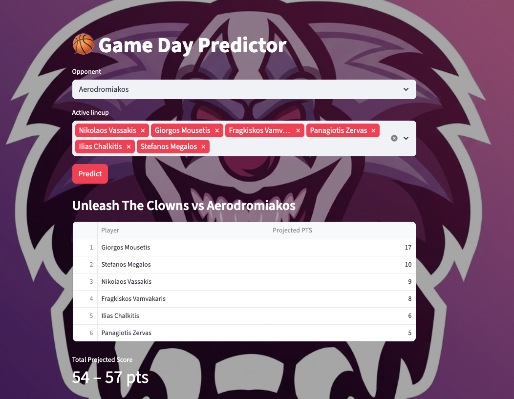

# Basketmaniacs Oracle: Predictive Analytics

> An end-to-end ML pipeline for predicting player and team performance in the [Basketmaniacs](https://basketmaniacs.com) amateur basketball league — from raw web scraping to a live game-day prediction app, retrained automatically every week.

*Can I predict how many points each player will score, using the league's game history?*

[](https://utc-pts.streamlit.app/)


---

## Quick Start

```bash
git clone https://github.com/nVassakis/basketball-stats.git
cd basketball-stats
python -m venv .venv && source .venv/bin/activate
pip install -r requirements.txt

# Run the full pipeline
python src/data/scraper.py
python src/data/parser.py
python src/data/ingest.py
python src/features/logic.py
python src/models/train.py

# Launch the app
streamlit run app.py
```

> The trained model (`model/xgb_model.json`) and database (`data/basketball.db`) are committed to this repo and updated weekly by CI — you can skip straight to `streamlit run app.py` if you just want to run the app.

---

## What It Does

- **Scrapes** box-score data from basketmaniacs.com across 12 teams
- **Builds** 37+ time-aware features at both player and team grain
- **Trains** two XGBoost models — one for individual player scoring, one for team totals
- **Serves** predictions through a Streamlit app: select tonight's lineup, get instant projections
- **Retrains** automatically every Monday via GitHub Actions — the model in this repo is always up to date


---

## Project Structure

```
basketball-stats/
├── app.py                    # Streamlit prediction app
├── src/
│   ├── data/                 # Scraping, parsing, ingestion
│   ├── features/             # Feature engineering
│   └── models/               # Model training
├── model/                    # Saved XGBoost models
├── data/basketball.db        # SQLite database
├── notebooks/                # EDA and experimentation
└── .github/workflows/        # Weekly automated retraining
```

For a full walkthrough of the pipeline architecture, feature design, and model evaluation methodology, see [src/README.md](src/README.md).

---

## The App

Select an opponent and your active players for the night. XGBoost predicts each player's score based on their recent form, season averages, and how this specific opponent has defended historically. You get per-player projected points and a team score range — before tip-off.

[**→ Try the app**](https://utc-pts.streamlit.app/)




